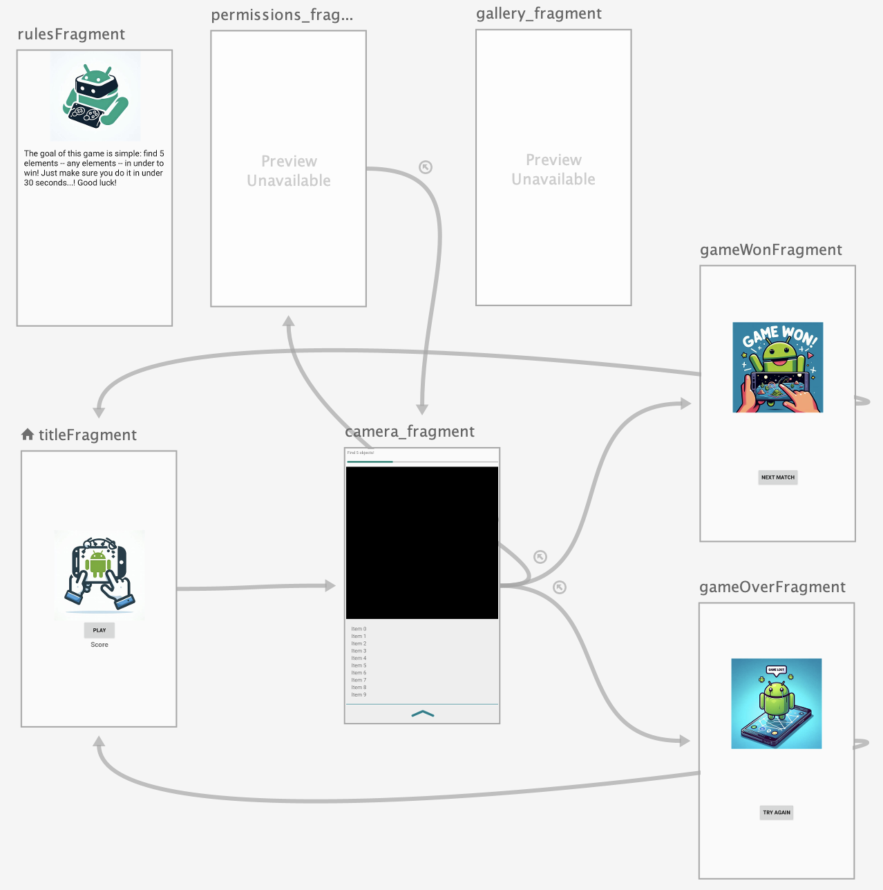
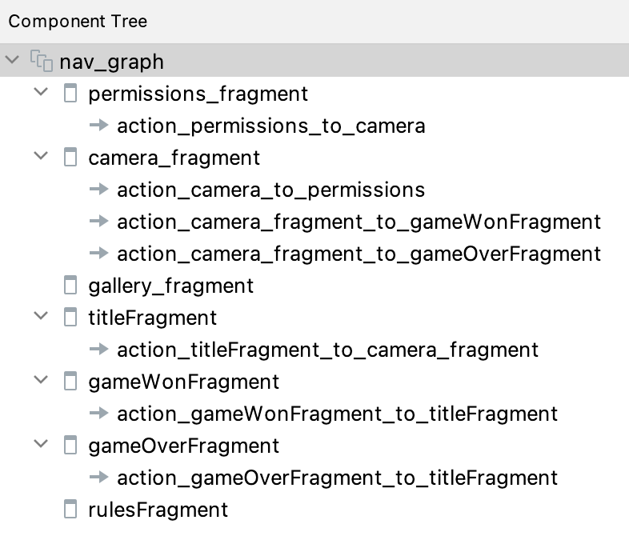

# Worksheet - Implementing Navigation in the MediaPipe Tasks Image Classification Android Demo



## Setup

- Install Android Studio:
  https://developer.android.com/studio/install
- Download/clone the "MediaPipe Tasks Image Classification Android Demo":
  https://github.com/googlesamples/mediapipe/tree/main/examples/image_classification/android
- Compile and run the demo app on your physical device (if one is available):
  https://developer.android.com/studio/run/device

## Update the resources and configuration

### Copy the provided images to res/drawable

### Enable data binding on build.gradle

```kotlin
buildFeatures {
    // ...
    dataBinding true
}
```

## Update the Main Activity and create the Navigation Drawer

### Create res/menu/navdrawer_menu.xml

```xml
<?xml version="1.0" encoding="utf-8"?>
<menu xmlns:app="http://schemas.android.com/apk/res-auto"
    xmlns:android="http://schemas.android.com/apk/res/android">

    <!-- This must be the same id as the nav_graph id of the fragment that will be displayed when this item is clicked. -->
    <item
        android:id="@+id/rulesFragment"
        android:title="Rules" />
</menu>
```

### Create the nav_header.xml layout file

```xml
<?xml version="1.0" encoding="utf-8"?>
<androidx.constraintlayout.widget.ConstraintLayout xmlns:android="http://schemas.android.com/apk/res/android"
    xmlns:app="http://schemas.android.com/apk/res-auto"
    xmlns:tools="http://schemas.android.com/tools"
    android:id="@+id/navHeader"
    android:layout_width="match_parent"
    android:layout_height="192dp"
    android:padding="16dp">

    <ImageView
        android:id="@+id/imageView"
        android:layout_width="wrap_content"
        android:layout_height="wrap_content"
        app:layout_constraintBottom_toBottomOf="parent"
        app:layout_constraintEnd_toEndOf="parent"
        app:layout_constraintStart_toStartOf="parent"
        app:layout_constraintTop_toTopOf="parent"
        app:srcCompat="@drawable/image3" />
</androidx.constraintlayout.widget.ConstraintLayout>
```


### Replace res/layout/activity_main.xml

```xml
<?xml version="1.0" encoding="utf-8"?>
<layout xmlns:android="http://schemas.android.com/apk/res/android"
    xmlns:app="http://schemas.android.com/apk/res-auto">

    <androidx.drawerlayout.widget.DrawerLayout
        android:id="@+id/drawerLayout"
        android:layout_width="match_parent"
        android:layout_height="match_parent">

        <LinearLayout
            android:layout_width="match_parent"
            android:layout_height="match_parent"
            android:orientation="vertical">

            <androidx.appcompat.widget.Toolbar
                android:id="@+id/toolbar"
                android:layout_width="match_parent"
                android:layout_height="?attr/actionBarSize"
                android:background="?attr/colorPrimary"
                />

            <fragment
                android:id="@+id/fragment_container"
                android:name="androidx.navigation.fragment.NavHostFragment"
                android:layout_width="match_parent"
                android:layout_height="match_parent"
                app:navGraph="@navigation/nav_graph"
                app:defaultNavHost="true"
                />
        </LinearLayout>

        <com.google.android.material.navigation.NavigationView
            android:id="@+id/navView"
            android:layout_width="wrap_content"
            android:layout_height="match_parent"
            android:layout_gravity="start"
            app:headerLayout="@layout/nav_header"
            app:menu="@menu/navdrawer_menu" />

    </androidx.drawerlayout.widget.DrawerLayout>
</layout>
```

### Update MainActivity.kt

```kotlin
class MainActivity : AppCompatActivity() {
  private lateinit var activityMainBinding: ActivityMainBinding
  private val viewModel: MainViewModel by viewModels()
  private lateinit var drawerLayout: DrawerLayout

  override fun onCreate(savedInstanceState: Bundle?) {
    super.onCreate(savedInstanceState)
    activityMainBinding = ActivityMainBinding.inflate(layoutInflater)
    setContentView(activityMainBinding.root)

    setSupportActionBar(findViewById(R.id.toolbar))
    drawerLayout = activityMainBinding.drawerLayout
    val navController = this.findNavController(R.id.fragment_container)
    NavigationUI.setupActionBarWithNavController(this, navController, drawerLayout)
    NavigationUI.setupWithNavController(activityMainBinding.navView, navController)
  }

  override fun onSupportNavigateUp(): Boolean {
    val navController = this.findNavController(R.id.fragment_container)
    return NavigationUI.navigateUp(navController, drawerLayout) || super.onSupportNavigateUp()
  }

  override fun onBackPressed() {
    finish()
  }
}
```

## Update camera_fragment.xml

```xml
<androidx.coordinatorlayout.widget.CoordinatorLayout xmlns:android="http://schemas.android.com/apk/res/android"
    xmlns:app="http://schemas.android.com/apk/res-auto"
    android:id="@+id/camera_container"
    android:layout_width="match_parent"
    android:layout_height="match_parent">

    <RelativeLayout
        android:id="@+id/game_info"
        android:layout_width="match_parent"
        android:layout_height="match_parent"
        android:orientation="vertical">

        <TextView
            android:id="@+id/label"
            android:layout_width="match_parent"
            android:layout_height="wrap_content"
            android:padding="5dp"
            android:text="Find 5 objects!"
            android:textSize="11sp" />

        <ProgressBar
            android:id="@+id/progressBar"
            style="?android:attr/progressBarStyleHorizontal"
            android:layout_width="match_parent"
            android:layout_height="wrap_content"
            android:padding="5dp"
            android:progress="30"
            android:layout_below="@id/label"
            />

        <androidx.camera.view.PreviewView
            android:id="@+id/view_finder"
            android:layout_width="match_parent"
            android:layout_height="180dp"
            android:layout_below="@id/progressBar"
            android:layout_alignParentBottom="true"
            />
    </RelativeLayout>

    <include
        android:id="@+id/bottom_sheet_layout"
        layout="@layout/info_bottom_sheet" />

    <androidx.recyclerview.widget.RecyclerView
        android:id="@+id/recyclerview_results"
        android:layout_width="match_parent"
        android:layout_height="wrap_content"
        android:layout_gravity="top"
        android:layout_marginBottom="@dimen/bottom_sheet_peek_height"
        android:background="@color/bottom_sheet_background"
        android:clipToPadding="true"
        android:padding="@dimen/bottom_sheet_padding"
        app:layout_anchor="@id/bottom_sheet_layout"
        app:layout_anchorGravity="center"
        app:layout_behavior="com.google.android.material.appbar.AppBarLayout$ScrollingViewBehavior" />

    <View
        android:layout_width="wrap_content"
        android:layout_height="1dp"
        android:background="@color/mp_color_primary"
        app:layout_anchor="@id/recyclerview_results"
        app:layout_anchorGravity="bottom" />
</androidx.coordinatorlayout.widget.CoordinatorLayout>

```

## Update the View Model

### Update MainViewModel.kt

```kotlin

class MainViewModel : ViewModel() {
    val labelLiveData = MutableLiveData<List<String>>()

    private var _gamesCompleted = 0
    private var _gamesWon = 0

    val gamesCompleted: Int
        get() = _gamesCompleted
    val gamesWon: Int
        get() = _gamesWon

    fun onGameFinished(won: Boolean) {
        _gamesCompleted++
        if (won) {
            _gamesWon++
        }
    }

    override fun toString(): String {
        return "played: $gamesCompleted    won: $gamesWon"
    }

    // ...
```

## Create the necessary Screens

### Create the fragments

- TitleFragment
- GameWonFragment
- GameLostFragment
- Rules Fragment (the .kt file is not needed, you may delete it).

### RulesFragment: layout/fragment_rules.xml

```xml
<ScrollView xmlns:android="http://schemas.android.com/apk/res/android"
    xmlns:app="http://schemas.android.com/apk/res-auto"
    android:layout_width="match_parent"
    android:layout_height="match_parent"
    android:fillViewport="true">

    <androidx.constraintlayout.widget.ConstraintLayout
        android:layout_width="match_parent"
        android:layout_height="wrap_content">

        <ImageView
            android:id="@+id/rulesImage"
            android:layout_width="0dp"
            android:layout_height="240dp"
            app:layout_constraintEnd_toEndOf="parent"
            app:layout_constraintStart_toStartOf="parent"
            app:layout_constraintTop_toTopOf="parent"
            app:srcCompat="@drawable/image1" />

        <TextView
            android:id="@+id/rulesText"
            android:layout_width="0dp"
            android:layout_height="wrap_content"
            android:padding="16dp"
            android:text="The goal of this game is simple: find 5 elements -- any elements -- in under to win! Just make sure you do it in under 30 seconds...! Good luck!"
            android:textAppearance="@style/TextAppearance.AppCompat.Large"
            app:layout_constraintEnd_toEndOf="parent"
            app:layout_constraintStart_toStartOf="parent"
            app:layout_constraintTop_toBottomOf="@+id/rulesImage" />
    </androidx.constraintlayout.widget.ConstraintLayout>
</ScrollView>
```

### TitleFragment: layout/fragment_title.xml

```xml
<layout xmlns:android="http://schemas.android.com/apk/res/android"
    xmlns:app="http://schemas.android.com/apk/res-auto"
    xmlns:tools="http://schemas.android.com/tools">

    <LinearLayout
        android:layout_width="match_parent"
        android:layout_height="match_parent"
        android:orientation="vertical"
        android:gravity="center"
        >

        <ImageView
            android:id="@+id/titleImage"
            android:layout_width="240dp"
            android:layout_height="240dp"
            app:srcCompat="@drawable/image3" />

        <Button
            android:id="@+id/playButton"
            android:layout_width="wrap_content"
            android:layout_height="wrap_content"
            android:text="Play"
            android:textStyle="bold"
            android:padding="16dp" />
            />

        <TextView
            android:id="@+id/scoreText"
            tools:text="Score"
            android:layout_width="wrap_content"
            android:layout_height="wrap_content"
            android:textStyle="bold"
            android:textSize="18dp" />
    </LinearLayout>
</layout>
```

### TitleFragment: TitleFragment.kt

```kotlin
class TitleFragment : Fragment() {
  private val viewModel: MainViewModel by activityViewModels()
  private lateinit var binding: FragmentTitleBinding

  override fun onCreateView(inflater: LayoutInflater, container: ViewGroup?,
                            savedInstanceState: Bundle?): View {
    binding = DataBindingUtil.inflate(inflater,
      R.layout.fragment_title,container,false)

    binding.playButton.setOnClickListener {
      it.findNavController().navigate(TitleFragmentDirections.actionTitleFragmentToCameraFragment())
    }

    setHasOptionsMenu(true)
    return binding.root
  }

  override fun onCreateOptionsMenu(menu: Menu, inflater: MenuInflater) {
    super.onCreateOptionsMenu(menu, inflater)
    inflater.inflate(R.menu.navdrawer_menu,menu)
  }

  override fun onOptionsItemSelected(item: MenuItem): Boolean {
    return NavigationUI.onNavDestinationSelected(item, requireView().findNavController())
        || super.onOptionsItemSelected(item)
  }

  override fun onResume() {
    super.onResume()

    binding.scoreText.text = viewModel.toString()
  }
}
```

### GameWonFragment: fragment_game_won.xml

```xml
<?xml version="1.0" encoding="utf-8"?>

<layout xmlns:android="http://schemas.android.com/apk/res/android"
    xmlns:app="http://schemas.android.com/apk/res-auto"
    xmlns:tools="http://schemas.android.com/tools"
    tools:context=".GameWonFragment">

    <androidx.constraintlayout.widget.ConstraintLayout
        android:id="@+id/gameWonConstraintLayout"
        android:layout_width="match_parent"
        android:layout_height="match_parent">

        <Button
            android:id="@+id/nextMatchButton"
            android:layout_width="wrap_content"
            android:layout_height="wrap_content"
            android:text="Next Match"
            android:textStyle="bold"
            app:layout_constraintBottom_toBottomOf="parent"
            app:layout_constraintEnd_toEndOf="parent"
            app:layout_constraintStart_toStartOf="parent"
            app:layout_constraintTop_toBottomOf="@id/youWinImage" />

        <ImageView
            android:id="@+id/youWinImage"
            android:layout_width="wrap_content"
            android:layout_height="240dp"
            app:layout_constraintBottom_toTopOf="@id/nextMatchButton"
            app:layout_constraintEnd_toEndOf="parent"
            app:layout_constraintStart_toStartOf="parent"
            app:layout_constraintTop_toTopOf="parent"
            app:layout_constraintVertical_chainStyle="spread"
            app:srcCompat="@drawable/image11" />

    </androidx.constraintlayout.widget.ConstraintLayout>
</layout>
```

### GameWonFragment: GameWonFragment.kt

```kotlin
class GameWonFragment : Fragment() {
  private val viewModel: MainViewModel by activityViewModels()

  override fun onCreateView(inflater: LayoutInflater, container: ViewGroup?,
                            savedInstanceState: Bundle?): View {
    val binding: FragmentGameWonBinding = DataBindingUtil.inflate(
      inflater, R.layout.fragment_game_won, container, false)

    binding.nextMatchButton.setOnClickListener { view: View ->
      view.findNavController().navigate(GameWonFragmentDirections.actionGameWonFragmentToTitleFragment())
    }

    viewModel.onGameFinished(won = true)

    return binding.root
  }
}
```

### GameOverFragment: fragment_game_over.xml

```xml
<layout xmlns:android="http://schemas.android.com/apk/res/android"
    xmlns:app="http://schemas.android.com/apk/res-auto"
    xmlns:tools="http://schemas.android.com/tools"
    tools:context=".GameOverFragment">

    <androidx.constraintlayout.widget.ConstraintLayout
        android:id="@+id/gameOverConstraintLayout"
        android:layout_width="match_parent"
        android:layout_height="match_parent">

        <ImageView
            android:id="@+id/tryAgainImage"
            android:layout_width="wrap_content"
            android:layout_height="240dp"
            app:layout_constraintBottom_toTopOf="@id/tryAgainButton"
            app:layout_constraintEnd_toEndOf="parent"
            app:layout_constraintStart_toStartOf="parent"
            app:layout_constraintTop_toTopOf="parent"
            app:layout_constraintVertical_chainStyle="spread"
            app:srcCompat="@drawable/image7" />

        <Button
            android:id="@+id/tryAgainButton"
            android:layout_width="wrap_content"
            android:layout_height="wrap_content"
            android:layout_marginBottom="8dp"
            android:text="Try Again"
            android:textStyle="bold"
            app:layout_constraintBottom_toBottomOf="parent"
            app:layout_constraintEnd_toEndOf="parent"
            app:layout_constraintStart_toStartOf="parent"
            app:layout_constraintTop_toBottomOf="@id/tryAgainImage" />
    </androidx.constraintlayout.widget.ConstraintLayout>
</layout>
```

### GameOverFragment: GameOverFragment.kt

```kotlin
class GameOverFragment : Fragment() {
  private val viewModel: MainViewModel by activityViewModels()

  override fun onCreateView(
    inflater: LayoutInflater, container: ViewGroup?,
    savedInstanceState: Bundle?
  ): View? {
    // Inflate the layout for this fragment
    val binding: FragmentGameOverBinding = DataBindingUtil.inflate(
      inflater, R.layout.fragment_game_over, container, false)

    binding.tryAgainButton.setOnClickListener { view: View ->
      view.findNavController().navigate(GameOverFragmentDirections.actionGameOverFragmentToTitleFragment())
    }
    viewModel.onGameFinished(won = false)

    return binding.root
  }
}
```

## Update the Navigation Graph

### Update nav_graph.xml

- add the following fragments and actions to the component tree of the navigation graph:




```xml
<?xml version="1.0" encoding="utf-8"?>
<navigation xmlns:android="http://schemas.android.com/apk/res/android"
    xmlns:app="http://schemas.android.com/apk/res-auto"
    xmlns:tools="http://schemas.android.com/tools"
    android:id="@+id/nav_graph"
    app:startDestination="@id/titleFragment">

    <fragment
        android:id="@+id/permissions_fragment"
        android:name="com.google.mediapipe.examples.imageclassification.fragments.PermissionsFragment"
        android:label="Permissions"
        >

        <action
            android:id="@+id/action_permissions_to_camera"
            app:destination="@id/camera_fragment"
            app:popUpTo="@id/permissions_fragment"
            app:popUpToInclusive="false" />

    </fragment>

    <fragment
        android:id="@+id/camera_fragment"
        android:name="com.google.mediapipe.examples.imageclassification.fragments.CameraFragment"
        android:label="Play the game!"
        tools:layout="@layout/fragment_camera"
        >
        <action
            android:id="@+id/action_camera_to_permissions"
            app:destination="@id/permissions_fragment"
            app:popUpTo="@id/titleFragment"
            app:popUpToInclusive="true" />
        <action
            android:id="@+id/action_camera_fragment_to_gameWonFragment"
            app:destination="@id/gameWonFragment"
            app:popUpTo="@id/titleFragment"
            app:popUpToInclusive="true"
            />
        <action
            android:id="@+id/action_camera_fragment_to_gameOverFragment"
            app:destination="@id/gameOverFragment"
            app:popUpTo="@id/titleFragment"
            app:popUpToInclusive="true"
            />
    </fragment>
    <fragment
        android:id="@+id/gallery_fragment"
        android:name="com.google.mediapipe.examples.imageclassification.fragments.GalleryFragment"
        android:label="Gallery" />
    <fragment
        android:id="@+id/titleFragment"
        android:name="com.google.mediapipe.examples.imageclassification.fragments.TitleFragment"
        android:label="Welcome!"
        tools:layout="@layout/fragment_title"
        >
        <action
            android:id="@+id/action_titleFragment_to_camera_fragment"
            app:destination="@id/camera_fragment" />
    </fragment>
    <fragment
        android:id="@+id/gameWonFragment"
        android:name="com.google.mediapipe.examples.imageclassification.fragments.GameWonFragment"
        android:label="Game Won!"
        app:popUpTo="@id/titleFragment"
        app:popUpToInclusive="true"
        tools:layout="@layout/fragment_game_won"
        >
        <action
            android:id="@+id/action_gameWonFragment_to_titleFragment"
            app:destination="@id/titleFragment" />
    </fragment>
    <fragment
        android:id="@+id/gameOverFragment"
        android:name="com.google.mediapipe.examples.imageclassification.fragments.GameOverFragment"
        android:label="Game Over..."
        app:popUpTo="@id/titleFragment"
        app:popUpToInclusive="true"
        tools:layout="@layout/fragment_game_over"
        >
        <action
            android:id="@+id/action_gameOverFragment_to_titleFragment"
            app:destination="@id/titleFragment" />
    </fragment>
    <fragment
        android:id="@+id/rulesFragment"
        android:name="com.google.mediapipe.examples.imageclassification.fragments.RulesFragment"
        android:label="RulesFragment"
        tools:layout="@layout/fragment_rules"
        />
</navigation>

```

## Implement the game's logic

### Update CameraFragment.kt

```kotlin
class CameraFragment : Fragment(), ImageClassifierHelper.ClassifierListener {

  // ...

  override fun onResume() {
    // ...

    gameLogic()
  }

  override fun onCreateView(
    inflater: LayoutInflater,
    container: ViewGroup?,
    savedInstanceState: Bundle?
  ): View {
    // ...

    (activity as AppCompatActivity?)?.supportActionBar?.setDisplayHomeAsUpEnabled(false)

    return fragmentCameraBinding.root
  }

  @SuppressLint("NotifyDataSetChanged")
  override fun onResults(
    resultBundle: ImageClassifierHelper.ResultBundle
  ) {

    for (result in resultBundle.results) {
      for (classification in result.classificationResult().classifications()) {
        if (classification.categories().isNotEmpty()) {
            val newLabel = classification.categories().first().categoryName()
            val currentList = viewModel.labelLiveData.value ?: emptyList()
            if (newLabel !in currentList) {
              val updatedList = currentList + newLabel
              viewModel.labelLiveData.postValue(updatedList)
          }
        }
      }
    }

    // ...
  }

  private fun gameLogic() {
    val totalTime = 30000L
    var elapsedTime = 0L
    var playing = false;

    val countDownTimer = object : CountDownTimer(30000, 1000) {
      override fun onTick(millisUntilFinished: Long) {
        val progress = ((totalTime - millisUntilFinished) / (totalTime / 100)).toInt()
        fragmentCameraBinding.progressBar.progress = progress
        elapsedTime = totalTime - millisUntilFinished
      }

      override fun onFinish() {
        Navigation.findNavController(
          requireActivity(), R.id.fragment_container
        ).navigate(CameraFragmentDirections.actionCameraFragmentToGameOverFragment())
      }
    }

    viewModel.labelLiveData.observe(this, Observer {
      Snackbar.make(fragmentCameraBinding.root, it.last(), Snackbar.LENGTH_LONG).show()

      if (playing)
        fragmentCameraBinding.label.text = it.size.toString() + ": " + it.toString()

      if (it.size >= 5 && playing) {
        countDownTimer.cancel()
        playing = false

        // navigate to game won fragment
        Navigation.findNavController(
          requireActivity(), R.id.fragment_container
        ).navigate(CameraFragmentDirections.actionCameraFragmentToGameWonFragment())
      }
    })

    AlertDialog.Builder(this@CameraFragment.activity)
      .setTitle("Play the Game!")
      .setMessage("Press the Start button to start the game.")
      .setPositiveButton("Start") { dialog, _ ->
        dialog.dismiss()
        playing = true
        countDownTimer.start()
      }
      .setCancelable(false)
      .show()
  }
}
```

Also, replace the former with the latter everywhere in your file:

```kotlin
imageClassifierHelper.currentModel = position
updateControlsUi()
```

should be replaced with

````kotlin
if (::imageClassifierHelper.isInitialized) {
  imageClassifierHelper.currentModel = position
  updateControlsUi()
}
````

### Full CameraFragment


```kotlin
/*
 * Copyright 2022 The TensorFlow Authors. All Rights Reserved.
 *
 * Licensed under the Apache License, Version 2.0 (the "License");
 * you may not use this file except in compliance with the License.
 * You may obtain a copy of the License at
 *
 *             http://www.apache.org/licenses/LICENSE-2.0
 *
 * Unless required by applicable law or agreed to in writing, software
 * distributed under the License is distributed on an "AS IS" BASIS,
 * WITHOUT WARRANTIES OR CONDITIONS OF ANY KIND, either express or implied.
 * See the License for the specific language governing permissions and
 * limitations under the License.
 */

package com.google.mediapipe.examples.imageclassification.fragments

import android.annotation.SuppressLint
import android.app.AlertDialog
import android.content.res.Configuration
import android.os.Bundle
import android.os.CountDownTimer
import android.util.Log
import android.view.LayoutInflater
import android.view.View
import android.view.ViewGroup
import android.widget.AdapterView
import android.widget.TextView
import android.widget.Toast
import androidx.appcompat.app.AppCompatActivity
import androidx.camera.core.AspectRatio
import androidx.camera.core.Camera
import androidx.camera.core.CameraSelector
import androidx.camera.core.ImageAnalysis
import androidx.camera.core.Preview
import androidx.camera.lifecycle.ProcessCameraProvider
import androidx.core.content.ContextCompat
import androidx.fragment.app.Fragment
import androidx.fragment.app.activityViewModels
import androidx.lifecycle.Observer
import androidx.navigation.Navigation
import androidx.navigation.findNavController
import androidx.navigation.fragment.findNavController
import androidx.navigation.ui.NavigationUI
import androidx.recyclerview.widget.LinearLayoutManager
import com.google.android.material.snackbar.Snackbar
import com.google.mediapipe.examples.imageclassification.ImageClassifierHelper
import com.google.mediapipe.examples.imageclassification.MainViewModel
import com.google.mediapipe.examples.imageclassification.R
import com.google.mediapipe.examples.imageclassification.databinding.FragmentCameraBinding
import com.google.mediapipe.tasks.vision.core.RunningMode
import java.util.concurrent.ExecutorService
import java.util.concurrent.Executors
import java.util.concurrent.TimeUnit

class CameraFragment : Fragment(), ImageClassifierHelper.ClassifierListener {

  companion object {
    private const val TAG = "Image Classifier"
  }

  private var _fragmentCameraBinding: FragmentCameraBinding? = null
  private val fragmentCameraBinding
    get() = _fragmentCameraBinding!!

  private val viewModel: MainViewModel by activityViewModels()
  private lateinit var imageClassifierHelper: ImageClassifierHelper
  private val classificationResultsAdapter by lazy {
    ClassificationResultsAdapter().apply {
      updateAdapterSize(viewModel.currentMaxResults)
    }
  }
  private var preview: Preview? = null
  private var imageAnalyzer: ImageAnalysis? = null
  private var camera: Camera? = null
  private var cameraProvider: ProcessCameraProvider? = null

  /** Blocking operations are performed using this executor */
  private lateinit var backgroundExecutor: ExecutorService


  override fun onResume() {
    super.onResume()

    if (!PermissionsFragment.hasPermissions(requireContext())) {
      Navigation.findNavController(
        requireActivity(), R.id.fragment_container
      ).navigate(CameraFragmentDirections.actionCameraToPermissions())
    }

    backgroundExecutor.execute {
      if (imageClassifierHelper.isClosed()) {
        imageClassifierHelper.setupImageClassifier()
      }
    }

    gameLogic() // TODO XXX
  }

  override fun onPause() {
    // save ImageClassifier settings
    viewModel.setModel(imageClassifierHelper.currentModel)
    viewModel.setDelegate(imageClassifierHelper.currentDelegate)
    viewModel.setThreshold(imageClassifierHelper.threshold)
    viewModel.setMaxResults(imageClassifierHelper.maxResults)
    super.onPause()

    // Close the image classifier and release resources
    backgroundExecutor.execute { imageClassifierHelper.clearImageClassifier() }
  }

  override fun onDestroyView() {
    _fragmentCameraBinding = null
    super.onDestroyView()

    // Shut down our background executor
    backgroundExecutor.shutdown()
    backgroundExecutor.awaitTermination(
      Long.MAX_VALUE, TimeUnit.NANOSECONDS
    )
  }

  override fun onCreateView(
    inflater: LayoutInflater,
    container: ViewGroup?,
    savedInstanceState: Bundle?
  ): View {
    _fragmentCameraBinding =
      FragmentCameraBinding.inflate(inflater, container, false)

    (activity as AppCompatActivity?)?.supportActionBar?.setDisplayHomeAsUpEnabled(false) // todo xxx

    return fragmentCameraBinding.root
  }

  @SuppressLint("MissingPermission")
  override fun onViewCreated(view: View, savedInstanceState: Bundle?) {
    super.onViewCreated(view, savedInstanceState)

    with(fragmentCameraBinding.recyclerviewResults) {
      layoutManager = LinearLayoutManager(requireContext())
      adapter = classificationResultsAdapter
    }

    backgroundExecutor = Executors.newSingleThreadExecutor()
    backgroundExecutor.execute {
      imageClassifierHelper = ImageClassifierHelper(
        context = requireContext(),
        runningMode = RunningMode.LIVE_STREAM,
        threshold = viewModel.currentThreshold,
        currentDelegate = viewModel.currentDelegate,
        currentModel = viewModel.currentModel,
        maxResults = viewModel.currentMaxResults,
        imageClassifierListener = this
      )

      fragmentCameraBinding.viewFinder.post {
        // Set up the camera and its use cases
        setUpCamera()
      }
    }
    // Attach listeners to UI control widgets
    initBottomSheetControls()
  }

  // Initialize CameraX, and prepare to bind the camera use cases
  private fun setUpCamera() {
    val cameraProviderFuture =
      ProcessCameraProvider.getInstance(requireContext())
    cameraProviderFuture.addListener(
      {
        // CameraProvider
        cameraProvider = cameraProviderFuture.get()

        // Build and bind the camera use cases
        bindCameraUseCases()
      }, ContextCompat.getMainExecutor(requireContext())
    )
  }

  private fun initBottomSheetControls() {
    // Init bottom sheet settings
    fragmentCameraBinding.bottomSheetLayout.maxResultsValue.text =
      viewModel.currentMaxResults.toString()

    fragmentCameraBinding.bottomSheetLayout.thresholdValue.text =
      String.format("%.2f", viewModel.currentThreshold)

    // When clicked, lower classification score threshold floor
    fragmentCameraBinding.bottomSheetLayout.thresholdMinus.setOnClickListener {
      if (imageClassifierHelper.threshold >= 0.2) {
        imageClassifierHelper.threshold -= 0.1f
        updateControlsUi()
      }
    }

    // When clicked, raise classification score threshold floor
    fragmentCameraBinding.bottomSheetLayout.thresholdPlus.setOnClickListener {
      if (imageClassifierHelper.threshold <= 0.8) {
        imageClassifierHelper.threshold += 0.1f
        updateControlsUi()
      }
    }

    // When clicked, reduce the number of objects that can be classified at a time
    fragmentCameraBinding.bottomSheetLayout.maxResultsMinus.setOnClickListener {
      if (imageClassifierHelper.maxResults > 1) {
        imageClassifierHelper.maxResults--
        updateControlsUi()
        classificationResultsAdapter.updateAdapterSize(size = imageClassifierHelper.maxResults)
      }
    }

    // When clicked, increase the number of objects that can be classified at a time
    fragmentCameraBinding.bottomSheetLayout.maxResultsPlus.setOnClickListener {
      if (imageClassifierHelper.maxResults < 3) {
        imageClassifierHelper.maxResults++
        updateControlsUi()
        classificationResultsAdapter.updateAdapterSize(size = imageClassifierHelper.maxResults)
      }
    }

    // When clicked, change the underlying hardware used for inference. Current options are CPU
    // GPU, and NNAPI
    fragmentCameraBinding.bottomSheetLayout.spinnerDelegate.setSelection(
      viewModel.currentDelegate, false
    )
    fragmentCameraBinding.bottomSheetLayout.spinnerDelegate.onItemSelectedListener =
      object : AdapterView.OnItemSelectedListener {
        override fun onItemSelected(
          parent: AdapterView<*>?,
          view: View?,
          position: Int,
          id: Long
        ) {
          if (::imageClassifierHelper.isInitialized) {
            imageClassifierHelper.currentDelegate = position
            updateControlsUi()
          }
        }

        override fun onNothingSelected(parent: AdapterView<*>?) {
          /* no op */
        }
      }

    // When clicked, change the underlying model used for object classification
    fragmentCameraBinding.bottomSheetLayout.spinnerModel.setSelection(
      viewModel.currentModel, false
    )
    fragmentCameraBinding.bottomSheetLayout.spinnerModel.onItemSelectedListener =
      object : AdapterView.OnItemSelectedListener {
        override fun onItemSelected(
          parent: AdapterView<*>?,
          view: View?,
          position: Int,
          id: Long
        ) {
          if (::imageClassifierHelper.isInitialized) { // todo xxx
            imageClassifierHelper.currentModel = position
            updateControlsUi()
          }
        }

        override fun onNothingSelected(parent: AdapterView<*>?) {
          /* no op */
        }
      }
  }

  // Update the values displayed in the bottom sheet. Reset classifier.
  private fun updateControlsUi() {
    fragmentCameraBinding.bottomSheetLayout.maxResultsValue.text =
      imageClassifierHelper.maxResults.toString()

    fragmentCameraBinding.bottomSheetLayout.thresholdValue.text =
      String.format("%.2f", imageClassifierHelper.threshold)

    backgroundExecutor.execute {
      imageClassifierHelper.clearImageClassifier()
      imageClassifierHelper.setupImageClassifier()
    }
  }

  override fun onConfigurationChanged(newConfig: Configuration) {
    super.onConfigurationChanged(newConfig)
    imageAnalyzer?.targetRotation =
      fragmentCameraBinding.viewFinder.display.rotation
  }

  // Declare and bind preview, capture and analysis use cases
  @SuppressLint("UnsafeOptInUsageError")
  private fun bindCameraUseCases() {

    // CameraProvider
    val cameraProvider = cameraProvider
      ?: throw IllegalStateException("Camera initialization failed.")

    // CameraSelector - makes assumption that we're only using the back camera
    val cameraSelector = CameraSelector.Builder()
      .requireLensFacing(CameraSelector.LENS_FACING_BACK).build()

    // Preview. Only using the 4:3 ratio because this is the closest to our models
    preview = Preview.Builder().setTargetAspectRatio(AspectRatio.RATIO_4_3)
      .setTargetRotation(fragmentCameraBinding.viewFinder.display.rotation)
      .build()

    imageAnalyzer =
      ImageAnalysis.Builder().setTargetAspectRatio(AspectRatio.RATIO_4_3)
        .setTargetRotation(fragmentCameraBinding.viewFinder.display.rotation)
        .setBackpressureStrategy(ImageAnalysis.STRATEGY_KEEP_ONLY_LATEST)
        .setOutputImageFormat(ImageAnalysis.OUTPUT_IMAGE_FORMAT_RGBA_8888)
        .build()
        // The analyzer can then be assigned to the instance
        .also {
          it.setAnalyzer(
            backgroundExecutor,
            imageClassifierHelper::classifyLiveStreamFrame
          )
        }

    // Must unbind the use-cases before rebinding them
    cameraProvider.unbindAll()

    try {
      // A variable number of use-cases can be passed here -
      // camera provides access to CameraControl & CameraInfo
      camera = cameraProvider.bindToLifecycle(
        this, cameraSelector, preview, imageAnalyzer
      )

      // Attach the viewfinder's surface provider to preview use case
      preview?.setSurfaceProvider(fragmentCameraBinding.viewFinder.surfaceProvider)
    } catch (exc: Exception) {
      Log.e(TAG, "Use case binding failed", exc)
    }
  }

  @SuppressLint("NotifyDataSetChanged")
  override fun onError(error: String, errorCode: Int) {
    activity?.runOnUiThread {
      Toast.makeText(requireContext(), error, Toast.LENGTH_SHORT).show()
      classificationResultsAdapter.updateResults(null)
      classificationResultsAdapter.notifyDataSetChanged()

      if (errorCode == ImageClassifierHelper.GPU_ERROR) {
        fragmentCameraBinding.bottomSheetLayout.spinnerDelegate.setSelection(
          ImageClassifierHelper.DELEGATE_CPU, false
        )
      }
    }
  }

  @SuppressLint("NotifyDataSetChanged")
  override fun onResults(
    resultBundle: ImageClassifierHelper.ResultBundle
  ) {

    for (result in resultBundle.results) { // TODO XXX
      for (classification in result.classificationResult().classifications()) {
        if (classification.categories().isNotEmpty()) {
            val newLabel = classification.categories().first().categoryName()
            val currentList = viewModel.labelLiveData.value ?: emptyList()
            if (newLabel !in currentList) {
              val updatedList = currentList + newLabel
              viewModel.labelLiveData.postValue(updatedList)
          }
        }
      }
    }

    activity?.runOnUiThread {
      if (_fragmentCameraBinding != null) {
        // Show result on bottom sheet
        classificationResultsAdapter.updateResults(
          resultBundle.results.first()
        )
        classificationResultsAdapter.notifyDataSetChanged()
        fragmentCameraBinding.bottomSheetLayout.inferenceTimeVal.text =
          String.format("%d ms", resultBundle.inferenceTime)
      }
    }
  }

  private fun gameLogic() {
    // Total time of the timer in milliseconds
    val totalTime = 30000L
    // Initialize the elapsed time to 0
    var elapsedTime = 0L
    var playing = false;

    // Start a timer
    val countDownTimer = object : CountDownTimer(30000, 1000) {
      override fun onTick(millisUntilFinished: Long) {
        // Calculate the progress based on the remaining time and the total time
        val progress = ((totalTime - millisUntilFinished) / (totalTime / 100)).toInt()

        // Update the progress of the ProgressBar
        fragmentCameraBinding.progressBar.progress = progress

        // Update the elapsed time
        elapsedTime = totalTime - millisUntilFinished
      }

      override fun onFinish() {
        // game lost
        // navigate to game over fragment
        Navigation.findNavController(
          requireActivity(), R.id.fragment_container
        ).navigate(CameraFragmentDirections.actionCameraFragmentToGameOverFragment())
      }
    }

    viewModel.labelLiveData.observe(this, Observer {
      Snackbar.make(fragmentCameraBinding.root, it.last(), Snackbar.LENGTH_LONG).show()

      if (playing)
        fragmentCameraBinding.label.text = it.size.toString() + ": " + it.toString()

      if (it.size >= 5 && playing) {
        countDownTimer.cancel()
        playing = false

        // navigate to game won fragment
        Navigation.findNavController(
          requireActivity(), R.id.fragment_container
        ).navigate(CameraFragmentDirections.actionCameraFragmentToGameWonFragment())
      }
    })

    // Show the dialog
    AlertDialog.Builder(this@CameraFragment.activity)
      .setTitle("Welcome")
      .setMessage("Press the start button to start the game.")
      .setPositiveButton("OK") { dialog, _ ->
        dialog.dismiss()
        playing = true
        countDownTimer.start()
      }
      .setCancelable(false) // Make the dialog modal
      .show()
  }
}

```
